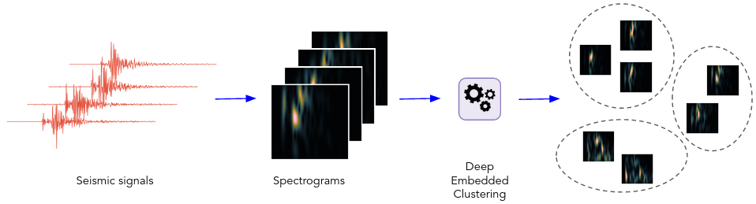
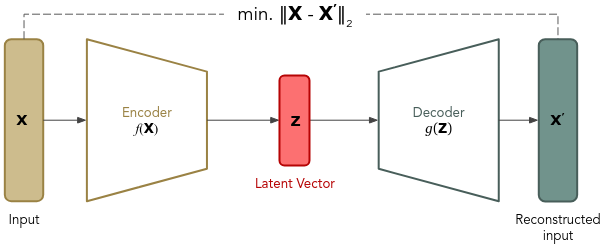
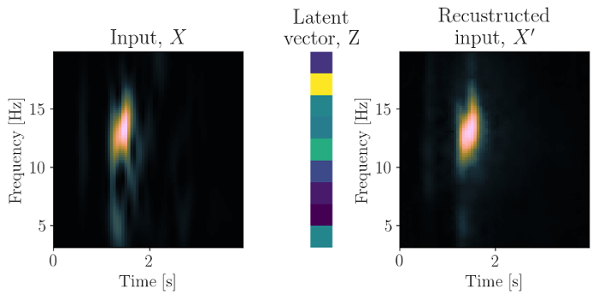
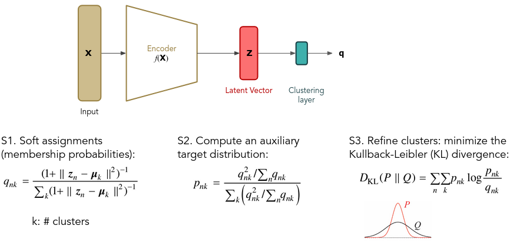

# zClust - Deep Embedded Clustering of Seismic Signals with Convolutional Autoencoder

Clustering is an unsupervised technique that separates the data into groups of
similar data points. This package implements seismic-signal clustering based on
deep neural networks.

The clustering is performed by simultaneously learning a set of cluster centers
in the latent feature space and the parameters of a deep neural network that
maps data points into latent feature space. It consists two phase:
1. parameter initialization with a deep convolutional autoencoder
2. parameter optimization (i.e., clustering), where in an iterative manner, an
auxiliary target distribution is computed and the Kullback-Leibler (KL)
divergence to it is minimized.

As input, the model uses spectrograms computed using the short-time Fourier
transform (STFT).

## Dependencies

- Python (== 3.9, with development headers)
- NumPy (== 1.22.3)
- SciPy (== 1.8.0)
- [PyTorch](https://pytorch.org/) (== 1.11.0)
- [scikit-learn](https://scikit-learn.org/stable/) (== 1.0.2)
- [xarray](https://docs.xarray.dev/en/stable/) (== 2022.3.0)
- [Pyrocko](https://pyrocko.org/) (== 2021.09.14)
- [Joblib](https://joblib.readthedocs.io/en/latest/) (== 1.1.0)

## Convolutional Autoencoder (CAE)

    

We use a fully convolutional autoencoder (CAE) to encode the salient features
of input spectrograms into a lower-dimensional latent features, called the
*embedded* layer. The size of the embedding layer is smaller than the input
data, so the autoencoder learns the most salient features of the input data.
This architecture is called *under-complete* autoencoder and is used for
dimensionality reduction.

The autoencoder is composed of convolutional and transposed convolutional
layers and minimizes the mean squared error (MSE) between an input spectrogram
and its reconstruction.

### Dimensionality Reduction

    

The effectiveness of the autoencoder's ability to reconstruct the input
spectrogram is illustrated in example figure above. Although some loss of
resolution in time and frequency is expected due to the convolutional and
transposed convolutional layers, the structure of the spectrogram is largely
preserved, with the salient information of the input encoded to the latent
feature space.

# Deep Embedded Clustering (DEC)

    

After the pretraining step, where the salient features of the data are learned
by the autoencoder weights, clustering algorithms can be applied to the data's
latent feature space. In this step, the decoder layers are discarded and only
the encoder layers are used as initial mapping between the data space and the
feature space. To initialize the cluster centers, the data is passed through
the initialized deep network to get embedded data points and then standard
*k*-means clustering is performed in the feature space to initialize cluster
centroids.

In this step:
1. first, soft assignment is performed, meaning that the degree of similarity
(or membership probability),
,
is measured between each embedded point,
,
and cluster centroids,
,
are calculated using Student’s t-distribution.

2. then, the soft assignments are used to compute an auxiliary target
distribution,
.

3. finally, clusters are refined by learning from their high confidence
assignments with the help of the auxiliary target distributionby. The objective
is to minimize the Kullback-Leibler (KL) divergence between the soft assignments,
,
and the target distribution,
.

#### References
* Xie, J., Girshick, R., & Farhadi, A. (2016). Unsupervised deep embedding for
clustering analysis. In International conference on machine learning
(pp. 478-487). PMLR.
